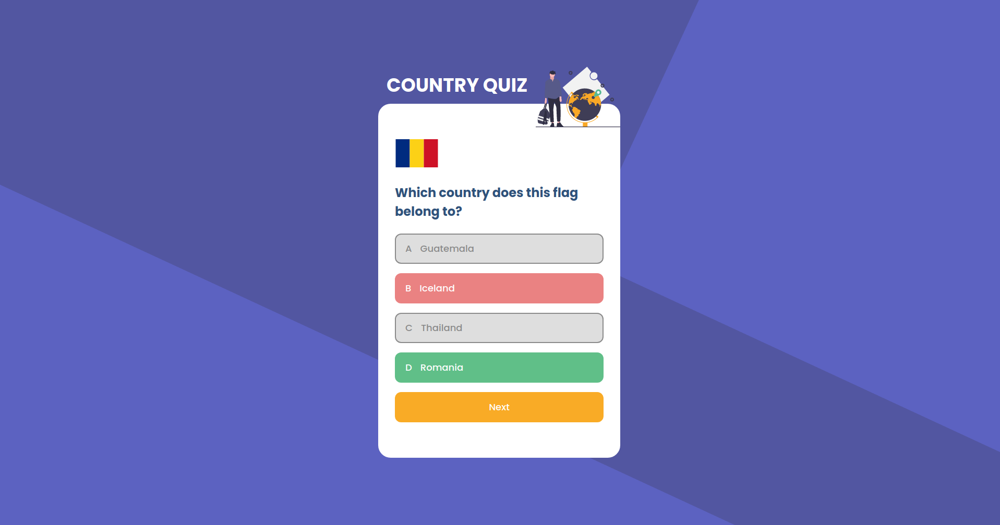

<h1 align="center">Country Quiz</h1>

<div align="center">
   Solution for a challenge from  <a href="http://devchallenges.io" target="_blank">Devchallenges.io</a>.
</div>

<div align="center">
  <h3>
    <a href="https://dev-challenge-country-quiz.netlify.app/">
      Demo
    </a>
    <span> | </span>
    <a href="https://github.com/hare451g/country-quiz">
      Solution
    </a>
    <span> | </span>
    <a href="https://devchallenges.io/challenges/Bu3G2irnaXmfwQ8sZkw8">
      Challenge
    </a>
  </h3>
</div>

<!-- TABLE OF CONTENTS -->

## Table of Contents

- [Overview](#overview)
  - [Built With](#built-with)
- [Features](#features)
- [How to use](#how-to-use)
- [Contact](#contact)
- [Acknowledgements](#acknowledgements)

## Overview



Introduce your projects by taking a screenshot or a gif. Try to tell visitors a story about your project by answering:

- Where can I see your demo?

  @ netlify, you can visit [https://dev-challenge-country-quiz.netlify.app/](https://dev-challenge-country-quiz.netlify.app/)

- What was your experience?

  bit confused at choosing state management, but at last I choose react's useReducer + immer for managing state, to too fancy but works as expected.

- What have you learned/improved?

  I have learn about using state machine logic for managing states is better than using boolean values. Also this is my first time using audio effects at web, it's fun !

- Your wisdom?

  as long as is works, it's fine.

### Built With

- [React](https://reactjs.org/)

## Features

This application/site was created as a submission to a [DevChallenges](https://devchallenges.io/challenges) challenge. The [challenge](https://devchallenges.io/challenges/Bu3G2irnaXmfwQ8sZkw8) was to build an application to complete the given user stories.

### Features:

- Two types of questions:
  - `a city is the capital of...`
  - `a lfag belong to country...`
- Multiple choices answer
- See correct answers
- Quiz Flow
  - When I answer correctly, I can move on to the next question
  - When I answer incorrectly, I can see my results and try again
- `Try again` choice

## How To Use

To clone and run this application, you'll need [Git](https://git-scm.com) and [Node.js](https://nodejs.org/en/download/) (which comes with [npm](http://npmjs.com)) installed on your computer. From your command line:

```bash
# Clone this repository
$ git clone https://github.com/your-user-name/your-project-name

# Install dependencies
$ yarn # or npm install

# Run the app
$ yarn start #or npm start
```

## Acknowledgements

- [Rest Countries API](https://restcountries.eu/#api-endpoints-all)
  REST API providing country informations.
- [Axios](https://github.com/axios/axios)
  HTTP Request library.
- [Emotion👩‍🎤](https://emotion.sh/docs/introduction)
  CSS in JS library.
- [Immer](https://immerjs.github.io/immer/docs/introduction)
  Immutability helpers library.

## Contact

- Website [hendrasadewa.site](https://hendrasadewa.site)
- GitHub [@hare451g](https://github.com/hare451g)
- Twitter [@sadevva\_](https://twitter.com/sadevva_)
